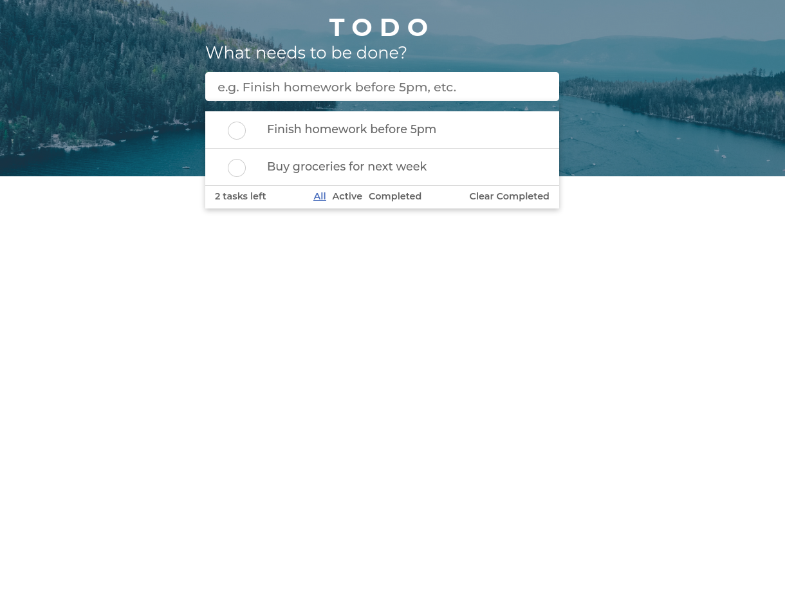

# react-todo-list
Todo list using ReactJS

## Demo

After cloning the repo, run `yarn` to install all the dependencies

To serve the app for development, run:
`yarn dev`

To build production, run:
`yarn build`